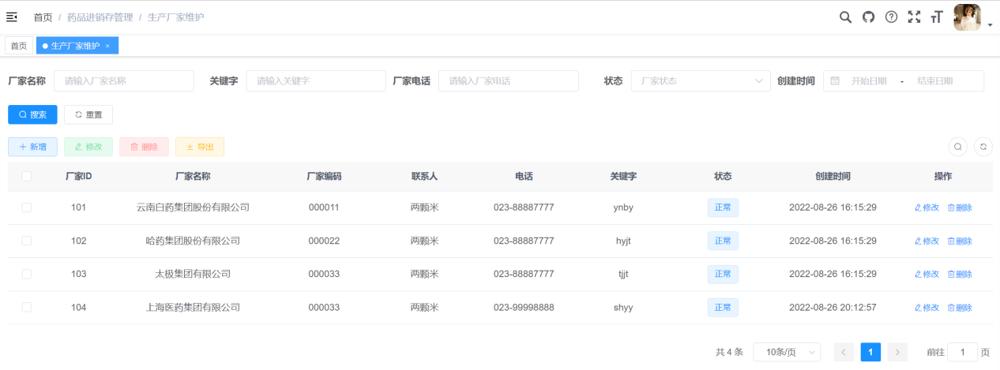
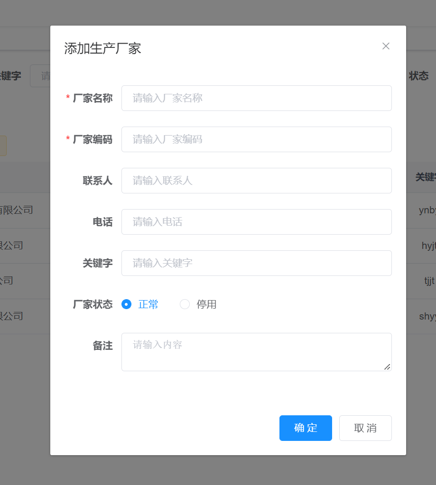
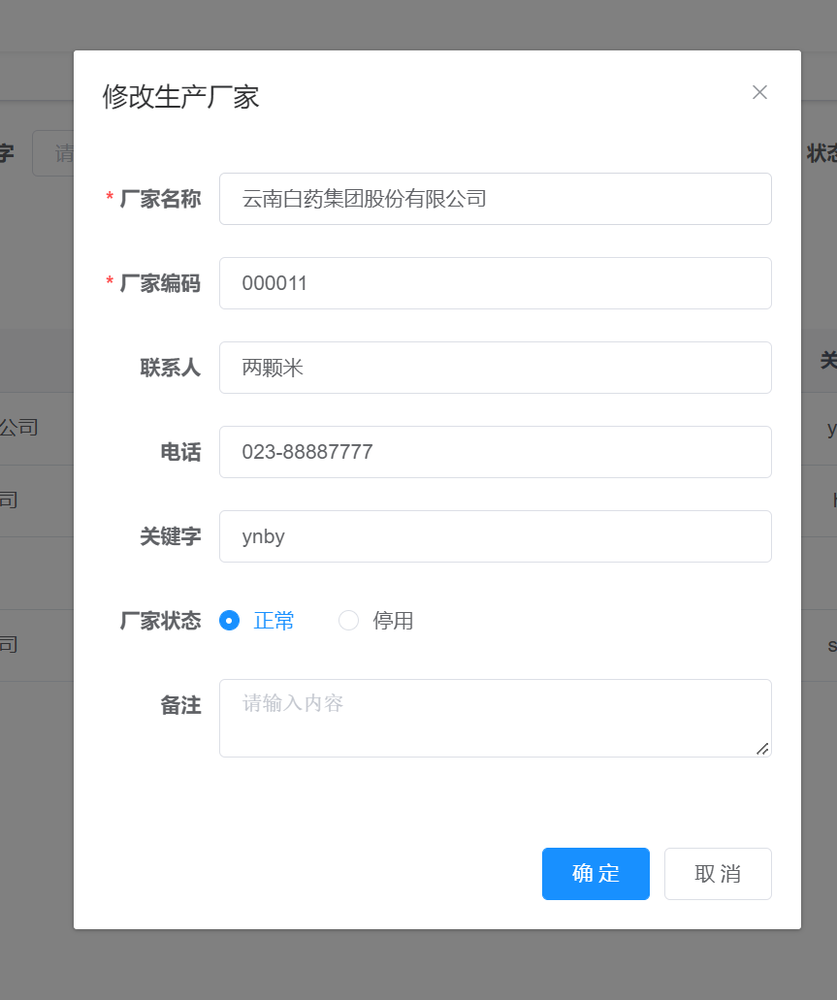
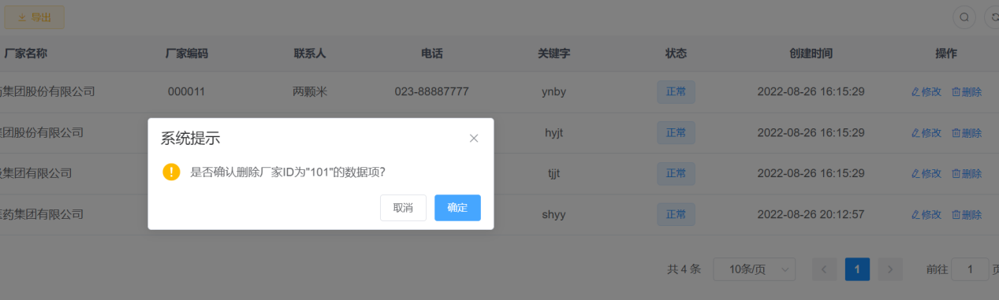
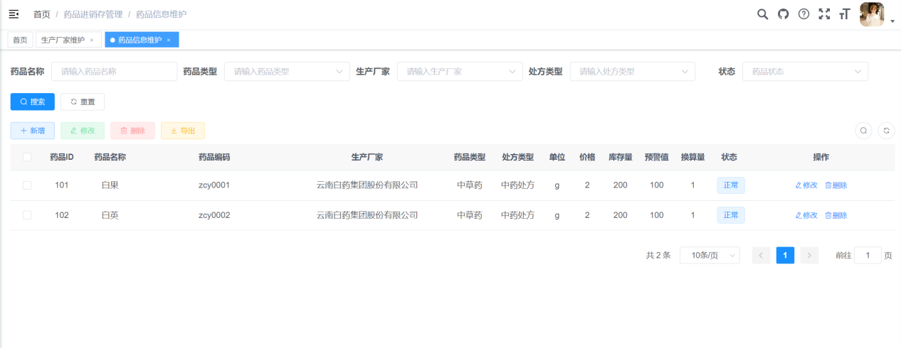
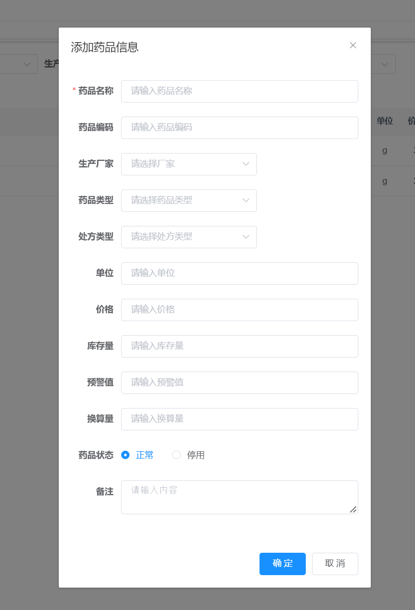
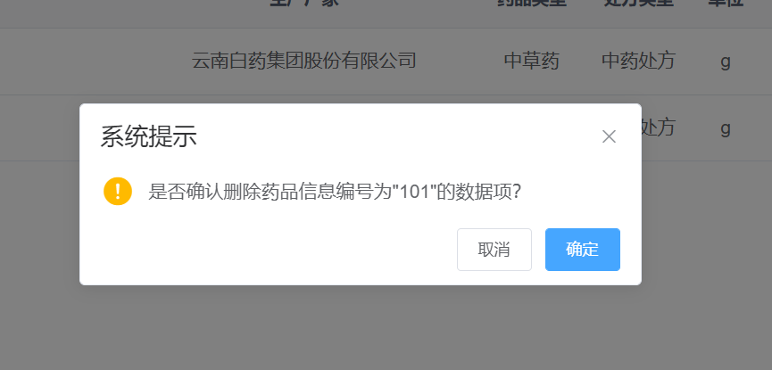

# 1-药品进销存管理系统

#### 1-1介绍

项目快速开发-若依框架二次开发-企业级项目研发 药品进销存系统

# 2-药品进销存管理

## 2-1生产厂家维护

### 2-1-1生产厂家查询

### 2-1-2生产厂家添加

### 2-1-3生产厂家修改

### 2-1-4生产厂家删除

### 2-1-5生产厂家导出

## 2-2药品信息维护

### 2-2-1药品信息查询

### 2-2-2药品信息添加

### 2-2-3药品信息修改

### 2-2-4药品信息删除

### 2-2-5药品信息导出
